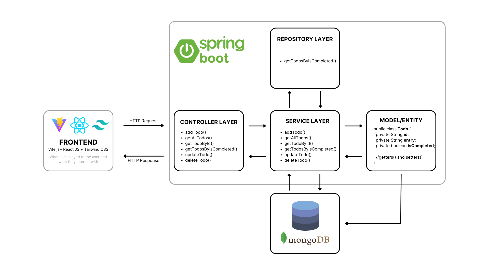
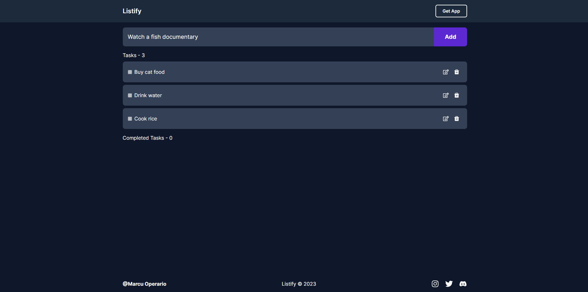
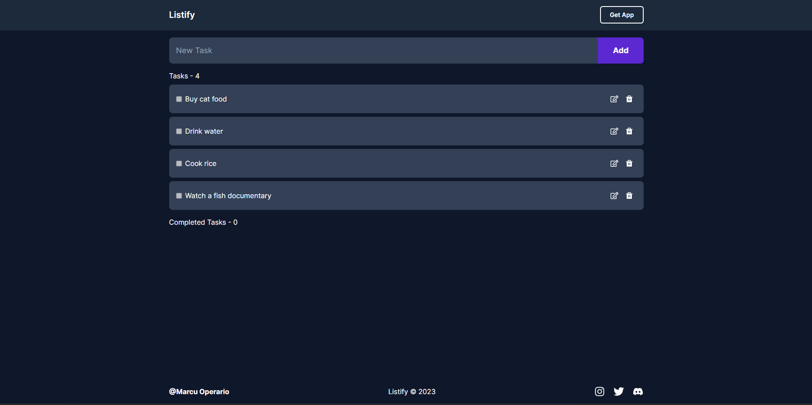
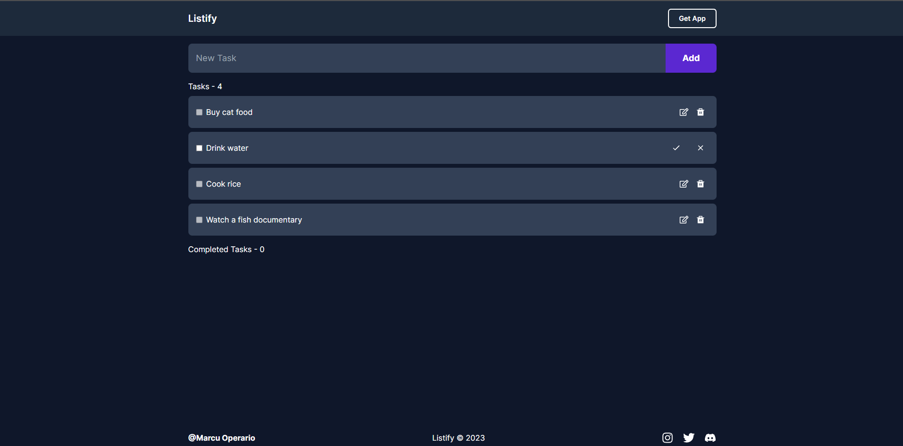
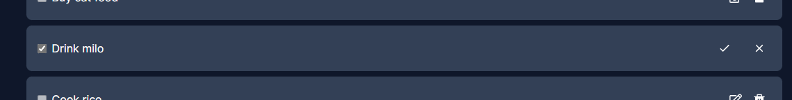
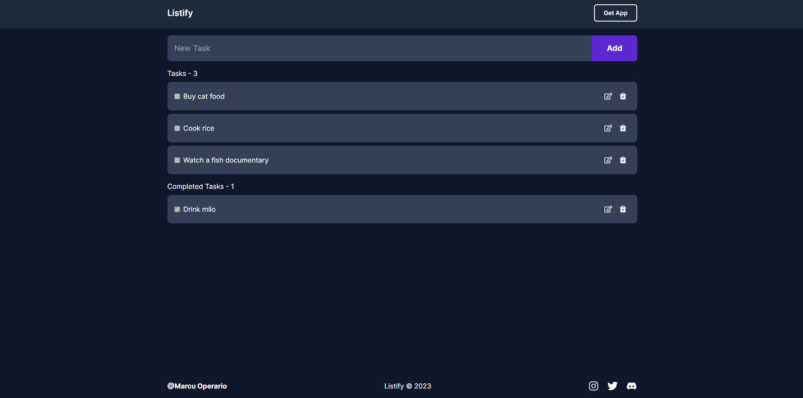
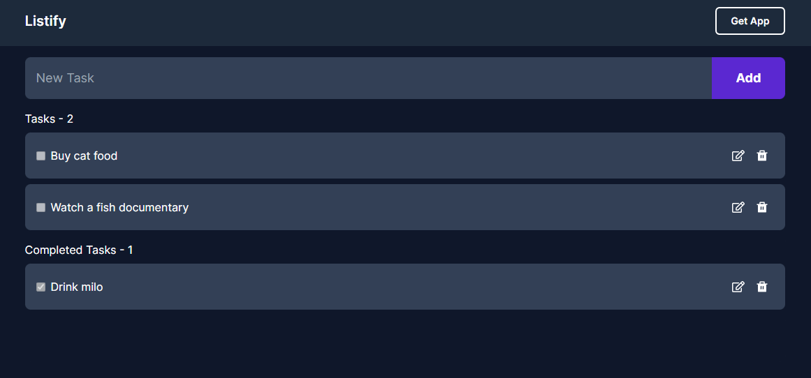

# Listify App
A full-stack application that utilizes the Spring Boot framework on the backend and React.js on the frontend to create a simple, yet functional todo list. The application allows users to create, read, update, and delete todo items in a user-friendly interface.

The following technologies were used:
- [Spring Boot](https://spring.io/projects/spring-boot): A popular Java web framework for building robust, scalable, and secure web applications. Spring Boot is built on top of the [Spring Framework](https://spring.io/projects/spring-framework), which provides a wide range of modules for building various components of web applications, such as Spring Web for building web applications, Spring Data for data access, and Spring Security for authentication and authorization.

- [Spring Web](https://docs.spring.io/spring-boot/docs/current/reference/html/web.html): A module of the Spring framework that provides support for building web applications.
- [Spring Data MongoDB](https://spring.io/projects/spring-data-mongodb): A module of the Spring Framework that provides integration with the [MongoDB NoSQL database](https://www.mongodb.com/).
- [Lombok](https://projectlombok.org/): A Java library that helps reduce boilerplate code in Java classes.
- [React.js](https://react.dev/): A popular JavaScript library for building user interfaces.
- [Vite.js](https://vitejs.dev/): A build tool that provides fast and efficient building and bundling of front-end applications.
- [Tailwind CSS](https://tailwindcss.com/): A utility-first CSS framework that allows developers to rapidly build custom user interfaces.
- [MongoDB Atlas](https://www.mongodb.com/atlas): A fully managed cloud database service provided by MongoDB.

# System Architecture 

# Current Features
- Create, read, update, and delete (CRUD) operations for todo items
- Responsive UI design for desktop and mobile devices using Tailwind CSS
- Integration with various third-party libraries and tools, such as Lombok and Maven

# Challenges Faced
- Responsive Styling the frontend with Tailwind CSS (fixed)
- Deeply nested components and unproper structure (fixed)
- Data typing in TypeScript (fixed)

# Future Features
- User authentication and authorization
- A search functionality to allow users to search for specific tasks
- Notifications and reminders for upcoming tasks

# Prequisites
The following are tools and software used in the making of this project:

- [Node.js 18.4.0](https://nodejs.org/en)
- [Java 17](https://www.oracle.com/java/technologies/downloads/)
- [Oracle OpenJDK 19.0.2 or higher](https://openjdk.org/projects/jdk/)
- [Visual Studio Code](https://code.visualstudio.com/Download)
- [IntelliJ IDEA Ultimate](https://www.jetbrains.com/idea/promo/?msclkid=6c29293616161025d6b84d208e6adbdc&utm_source=bing&utm_medium=cpc&utm_campaign=APAC_en_ASIA_IDEA_Branded&utm_term=intellij&utm_content=intellij%20idea)

Further instructions on how to install and run the [backend](https://github.com/SinugbangIsda/spring-boot-reactjs-todolist/tree/main/backend) and [frontend](https://github.com/SinugbangIsda/spring-boot-reactjs-todolist/tree/main/frontend) of this application can be found in the README files of their respective directories in the repository.

# System Screenshots
Adding a todo item:

Editing a todo item:

Deleting a todo item:

# Contributing
Contributions are always welcome! If you find any issues or have any suggestions, please open a new issue or submit a pull request.

# References
- [Spring Boot - Build a CRUD REST API with MongoDB Atlas | JavaTechie](https://www.youtube.com/watch?v=qVNOw9TWwxo&t=1976s)
- [Spring Boot Tutorial - Build a Rest Api with MongoDB](https://www.youtube.com/watch?v=ssj0CGxv60k&t=3164s)
- [How To Set Up a React Project with Vite](https://www.digitalocean.com/community/tutorials/how-to-set-up-a-react-project-with-vite)
- [Learn React](https://www.codecademy.com/learn/react-101)
- [TypeScript Tutorial: A step-by-step guide to learn TypeScript](https://www.educative.io/blog/typescript-tutorial)
- [Basic Types (Typescript)](https://www.typescriptlang.org/docs/handbook/basic-types.html)
- [How to create your own custom React Hooks](https://blog.logrocket.com/create-your-own-custom-react-hooks/)
- [Getting started with Tailwind CSS](https://v2.tailwindcss.com/docs)
